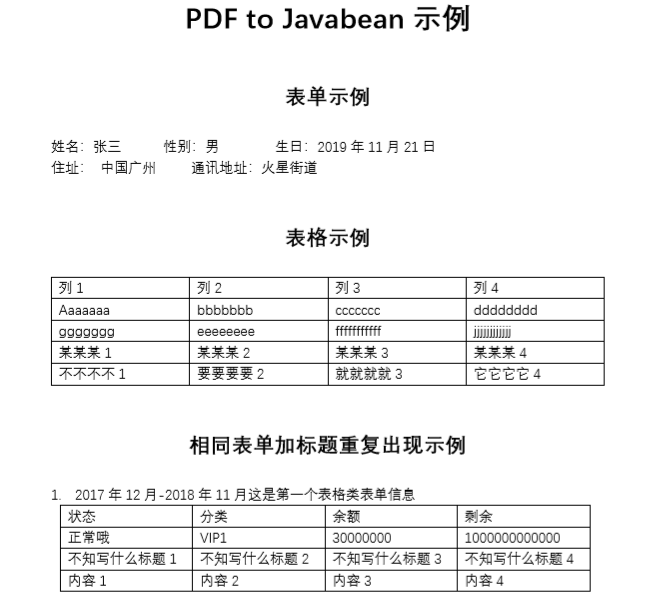

# text2bean
Mapping a pdf file to Java bean or a text file

PDFLayoutTextStripper is a copy of JonathanLink (from the [PDFLayoutTextStripper](https://github.com/JonathanLink/PDFLayoutTextStripper) library).

Using PDFLayoutTextStripper get the fullText of the PDF. And then Read each line for regular expression matching and attribute mapping by result.

Example ini file see [simple.ini](src/test/resources/simple.ini)

## Use case

Example in PDF file



Conversion result

```
{column1: 不不不不 1, column2: 要要要要 2, column3: 就就就就 3, column4: 它它它它 4}
{address=中国广州, contact=火星街道}
{title: 2.2019年12月-2020年11月这是第一个表格类表单信息, status: 有点怪, category: VIP2, balance: 3222000, remain: 10088800000, other1: 内容差异 1                   内容差异 2                   内容 3 差异                  内容差异 4                                    , other2:  , other3:  , other4:  }
{column1: Aaaaaaa, column2: bbbbbbb, column3: ccccccc, column4: dddddddd}
{title: null, status: null, category: null, balance: null, remain: null, other1: 内容差异 5                   内容差异 6                   内容差异 7                   内容差异 8                                    , other2:  , other3:  , other4:  }
{title: 4.2016年12月-2019年11月这是第一个表格类表单信息, status: 变态, category: VIP4, balance: -30000, remain: -1000000000000, other1: 内容差异 9                   内容差异 10                  内容差异 11                  内容差异 12                                   , other2:  , other3:  , other4:  }
{column1: 某某某 1, column2: 某某某 2, column3: 某某某 3, column4: 某某某 4}
{name: 张三, sex: 男, birthday: 2019年11月21日, address: null, contact: null}
{column1: ggggggg, column2: eeeeeeee, column3: fffffffffff, column4: jjjjjjjjjjjj}
{title: 1.2017年12月-2018年11月这是第一个表格类表单信息, status: 正常哦, category: VIP1, balance: 30000000, remain: 1000000000000, other1: 内容 1                     内容 2                     内容 3                     内容 4                                      , other2:  , other3:  , other4:  }
{title: 3.2021年12月-2022年11月这是第一个表格类表单信息, status: 太正常了, category: VIP3, balance: 38050000, remain: 10099900000, other1: null, other2: null, other3: null, other4: null}
``` 

More detail see the [PdfParseTest.java](src/test/java/example/PdfParseTest.java) 